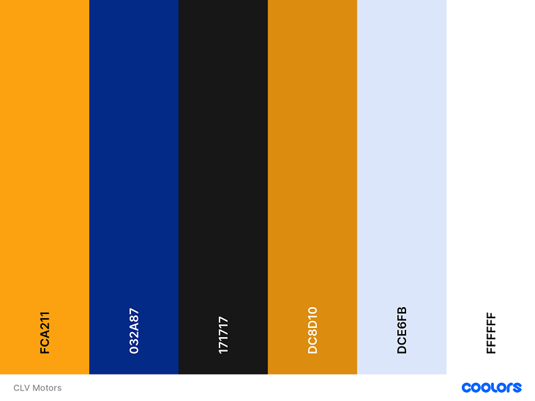

<h1 align="center">
  CLV Motors - New and used car sales website 🚗🏎️
</h1>

   When we started this journey, we noticed a gap in the automotive sales market. There was a lack of platforms that offered a complete, intuitive and reliable experience for car lovers. So we decided to create something unique, something that didn't just sell vehicles, but was a space for car lovers to connect, explore and discover their next machine on wheels.
 Our team is constantly working to improve the site's interface, making it more user-friendly and informative. We want our users to find not just a car, but all the information they need to make the best possible decision.

 

  

This is a project where we are learning how use PHP language, however, we have built a site based on HTML and embellished it with CSS for a better user experience (UX).
  

  
<h1 align="center">
  Quick front-end presentation of our project  
</h1>

 
  Link -> https://github.com/orgs/CLV-Motors/repositories

<h1 align="center">
  
</h1>

 

## Functionalities

:heavy_check_mark: Sale and purchase of Cars;

:heavy_check_mark: Information about various vehicles;

:heavy_check_mark: Comparison between vehicles.

 

## Justification

  
 
  CLV Motors was founded to fill the gap in the automotive market, offering a platform that goes beyond simply buying and selling cars. Our goal is to provide a complete, comprehensive and customer-centric experience, promoting transparency, market growth, trust and continuous innovation. These fundamental pillars drive our mission to be the benchmark in the automotive world.
  

  
## Objective

  
 
  Our goal from day one has been to grow in the car sales market, offering more than just commercial transactions. We want to be a reference point, a community where enthusiasts and potential buyers can feel at home. Our site isn't just a place to buy and sell cars; it's an environment where passion for automobiles meets cutting-edge technology to provide an exceptional experience.
  We want to be recognized as the number one choice for those looking not just for a vehicle, but for a complete experience in the automotive world.

## Materials and Methods

  
 
 Using HTML and CSS and PHP and SQL ligations...
  

## Expected Results

  
 
  We want to offer a wide range of vehicles, from the most iconic classics to the most innovative models, all with the guarantee of quality and transparency in every detail.
    We are committed to sustainable growth in the market, maintaining our position as a reliable reference for online car shopping and constantly improving the user experience. Innovation is our focus, always aiming to update our platform with cutting-edge technologies to anticipate customer needs. We want you to feel confident when making your choices, providing accurate and reliable information so that every purchase is a rewarding and safe experience.
  

 

<h1 align="center">
  Our identification logos
</h1>

| Bottom Blue | Bottom White | Bottom Yellow |
|:----------:|:---------:|:--------:|
|  |  |  |

  
 
  Color palette used in the project:
  

ler e reproduzir aqui
https://dev.to/reginadiana/como-escrever-um-readme-md-sensacional-no-github-4509

<h4 align="justify"> 
  🚧  Project 🚀 in progress...  🚧
<h4></h4>

## License

The [MIT License](LICENSE) (MIT)

Copyright :copyright: 2023 - CLV Motors

